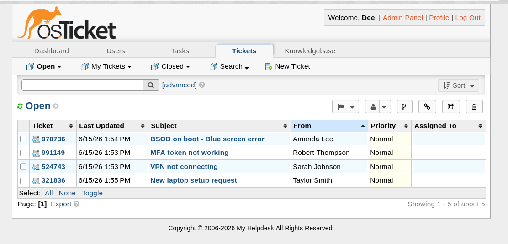
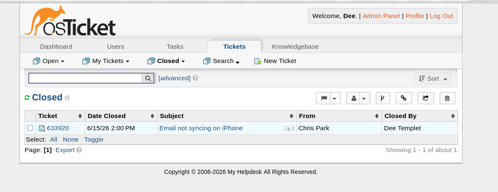
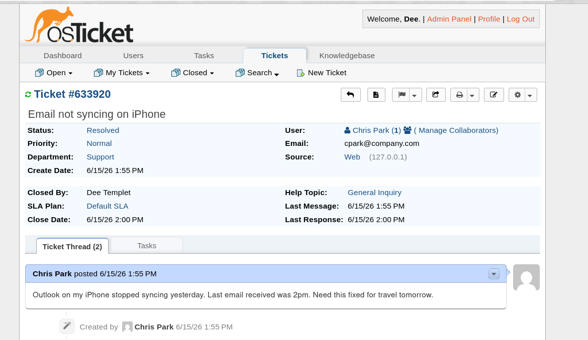
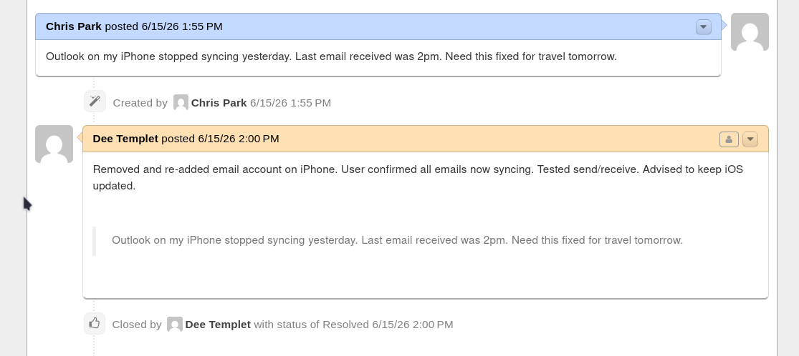

# osTicket Helpdesk Lab

## Project Overview
I built a fully functional helpdesk ticketing system on Fedora Linux to learn real-world IT support workflows used in enterprise environments.

## Why This Matters
Helpdesk ticketing systems (like osTicket, ServiceNow, Zendesk) are how IT teams track and resolve employee issues. This project demonstrates I understand the complete ticket lifecycle before ever working a real helpdesk job.

## Technologies Used
- **OS:** Fedora Linux
- **Web Server:** Apache (HTTPD)
- **Database:** MariaDB (MySQL)
- **Backend:** PHP 8.4
- **Helpdesk App:** osTicket v1.18.1

## What I Did
- Set up LAMP stack (Linux, Apache, MySQL, PHP) from scratch on Fedora
- Configured osTicket with admin and customer portals
- Created and resolved practice tickets simulating real IT scenarios:
  - 🖨️ **Printer troubleshooting** — Reseated network cables, verified printing
  - 🔐 **Password reset** — Reset AD password, user confirmed login
  - 💻 **Software installation** — Installed Zoom, tested audio/video
  - 🔌 **VPN connection issue** — Diagnosed authentication errors
  - 📱 **Email sync problem** — Reconciled mobile device settings

## Screenshots

### Open Tickets

### Resolved Tickets

### Ticket Detail

### Resolution Comment

## What I Learned
- **Ticket lifecycle:** Intake → Prioritize → Resolve → Document (ITIL-style workflow)
- **LAMP stack deployment:** Hands-on with Apache, MySQL, PHP configuration
- **Helpdesk workflow:** Customer portal (submit tickets) vs agent panel (resolve tickets)
- **Documentation:** Why every resolution needs a clear, auditable note

## Live Demo
This project runs locally on my machine. Screenshots above demonstrate full functionality.

## Connect With Me
- **Email:** dtemplet578@gmail.com
- **GitHub:** [github.com/d-templet](https://github.com/d-templet)
- **LinkedIn:** [Add your LinkedIn URL here]

---

*Built as part of my journey from CS student to IT professional.*
